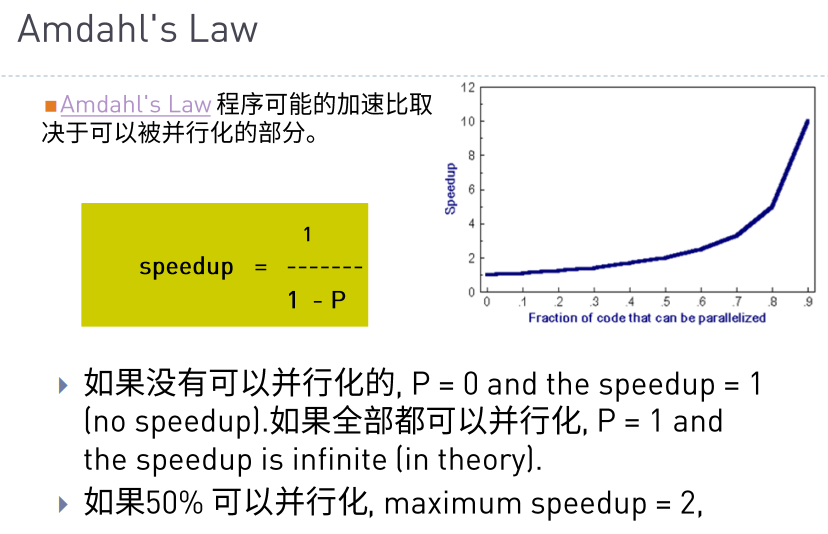
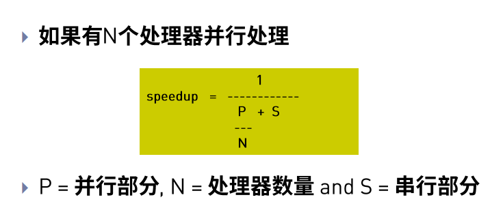
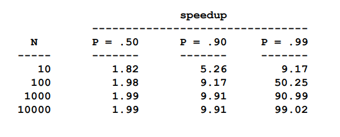
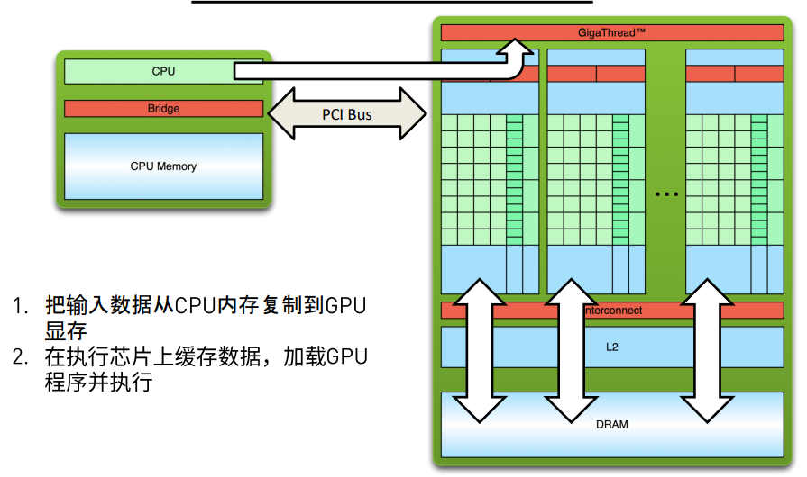
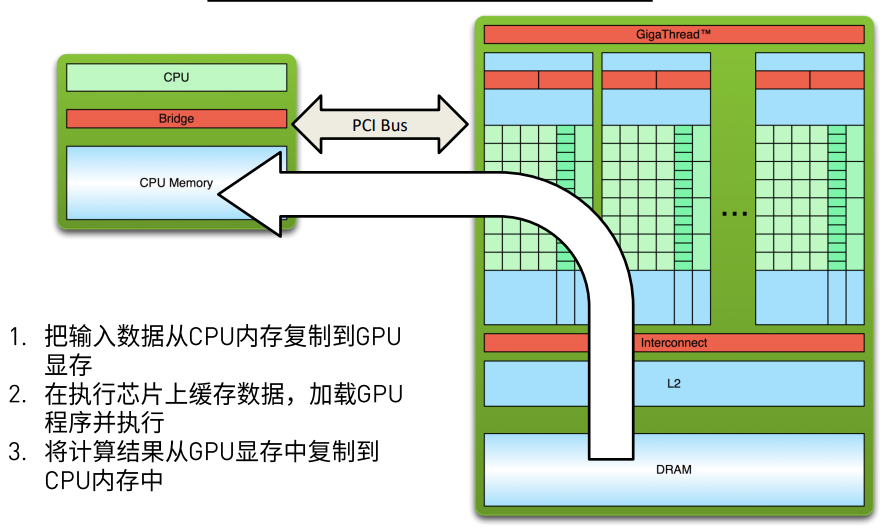
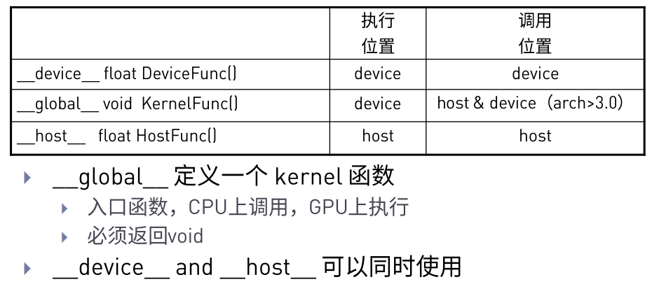
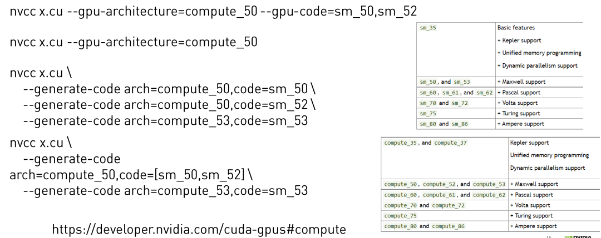
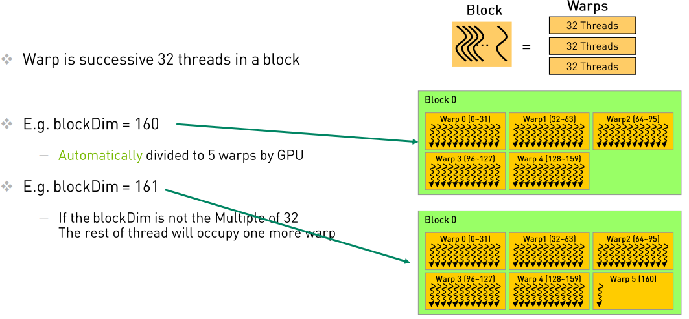
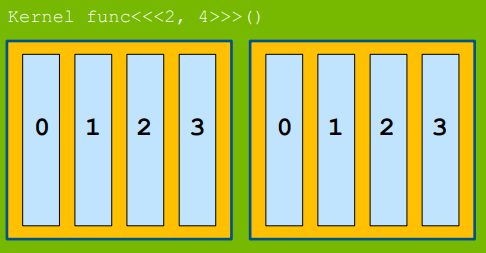

## 简述

今天的主要学习内容包括课程说明，Cuda和Gpu简介，简单的Linux操作，简单的Cuda编程。

简单复习几个并行化指标、MakeFile和Cuda编程内容

## 并行化指标--加速比

### 加速比的理解

加速比主要是为了对比并行Gpu计算的情况下比串行Cpu计算代码速度有多大的提升，其计算公式在下图中：



按照文字进行理解，假定有80%的内容可以进行并行话，那么

`Speedup = 1 / (1 - 0.8)  = 5`

对于并行的加速比计算公式如下：



### 加速比的极限

加速比是存在上限的，根据上图我们可以知道，当 N 越大的时候， P/N 就会越小，也就表示分母越小，从而加速比越大。

但是，P/N 也受到 P 的制约，由于 S + P = 1 ，所以 S 的大小也决定着加速比的上限，按照 p=.50 、 p=.90 、 p=.99 进行加速比计算举例，结果如图：



可以看到加速比是没能随着`N`的增加而继续增加的。

## MakeFile

### 个人理解

MakeFile是编译C，C++的一个文件，按照MakeFile内的内容对部分的文件进行编译或者文件的生成。

### 简单指令示例

使用 `make` 执行MakeFile文件。如果MakeFile内写有 `Clean` 等内容，可以使用 `make clean` 执行清理操作

```shell
OBJ = main.o add.o sub.o mul.o div.o
CC = gcc
app: $(OBJ)
	$(CC) -o app $(OBJ)
main.o: main.c
	$(CC) -c main.c
add.o: add.c
	$(CC) -c add.c
sub.o:sub.c
	$(CC) -c sub.c
mul.o: mul.c
	$(CC) -c mul.c
div.o: div.c
	$(CC) -c div.c
.PHONY : clean
clean :
	-rm $(OBJ) app
```

从上面的代码可以看出，临时变量写在最开始，使用的时候使用 `$()` 进行包裹指代，而 `clean` 应该写在最后，以免影响 `make` 指令的执行顺序。

`.PHONY : clean` 中应该关注 `.PHONY` 这一项，因为这个关键字主要是为了避免指令和文件名冲突，假如目录下同样存在 `clean` 文件，
那么 `make clean` 在没有 `.PHONY` 的情况下会报错（可以自行尝试）。

另外需要注意，换行之后尽量使用 `TAB` 进行缩进。

### Cuda代码示例

课件中同样提供了Cuda编译使用的一个示例：

```shell
TEST_SOURCE = hello_cuda.cu
TARGETBIN := ./hello_cuda
CC = /usr/local/cuda/bin/nvcc
$(TARGETBIN):$(TEST_SOURCE)
	$(CC)  $(TEST_SOURCE) -o $(TARGETBIN)
.PHONY:clean
clean:
	-rm -rf $(TARGETBIN)
```

可以看到基本的内容和上面是一样的，只是编译的文件从 `xxx.c` 变成了 `xxx.cu`，编译指令从 `gcc` 变成了 `nvcc` 。其他并无不同。

## Cuda编程初识

课程内容比较多，就简单挑着自己的理解去写了。

### 数据传输

在进行代码之前，先对cuda的数据传输进行一定的了解，由于是操作GPU进行计算，所以主要的数据其实都应该导入到GPU的缓存中进行，包括部分指令也会在GPU上操作。

所以可以看到如下图所示：



在运行执行结束之后，运算结果讲重新搬回CPU中，进行下一步的操作。如下图：



所以这几步操作会体现在代码中会有一定的复制、转移的操作，同时内存申请和释放也会比单纯的串行程序使用更多一步GPU的内存申请和释放。

### 运行位置

在CUDA编程中，程序执行和调用的位置会有两个，一个是CPU（也称Host），另外一个则是GPU（也称Device）。函数模式，则一共有三种，分别是： `__device__`， `__global__`， `__host__`。先看下图：



根据上图我们可以看到 `__device__` 很明显应该是在GPU设备中被调用然后执行，而 `__global__` 则是从CPU到GPU的过度函数，甚至就是使用GPU的函数，而`__host__`则是单纯的CPU函数，也就是常规的C函数。

### CUDA程序编译

在上面的MakeFile中已经进行了简单的差异描述，但是，为了保证编译后的文件的可用，GPU编译比CPU编译多了一个参数，通常是为了指定架构，例如` arch = 60`，由于走神，这里没太懂，所以放一下PPT图片：



### NVPROF：程序分析软件

主要是三种模式，每种模式都有不同的显示内容：

```
nvprof a.exe

nvprof --print-gpu-trace a.exe

nvprof --print-api-trace a.exe

```

### CUDA线程调度

在线程调度这一部分，主要有三个层级`Grid`，`Block`，`Thread`，其中`Thread`是常见的线程，而`Block`是为了管理`Thread`而出现的，在常规的GPU core中，一个`Block`通常拥有32个`Thread`。

而`Grid`则是管理`Block`的，在线程层次和线程调度入门中，个人认为有两个地方较为重要：一是线程的组织结构，二是线程索引。

#### 组织结构

从`Thread`开始，首先我们应该注意，`Thread`会被`wrap`调度器以32个为一组，组成一个`wrap`，但是`Block`才是管理`thread`的，所以`Block_si
ze`应该是以32作为倍数，比如32或者64，以求最大化使用算力。



而接下来，由`Thread`组成了`Block`，在基础的情况中中，`<<<BLOCKS,BLOCK_SIZE>>>`表示的是申请`BLOCKS`个`Block`，每个`Block`内部有
`BLOCK_SIZE`个`Thread`，这时候情况较为简单，`Grid`的应该是一个`1XBLOCKS`的长矩阵，每个`Block`也是一个`1xBLOCK_SIZE`的长矩阵。



接下来是由dim3构成的高纬度线程模型，举例来说，我们可以由`dim3 grid_size(3,3,3)`定义出一个3x3x3的三维矩阵，在这个矩阵中，一共有27个`Block`，
此时，这个`Grid`的维度，也就是`gridDim.x`、`gridDim.y`、`gridDim.z`三个值，均为3，也就是`blockIdx`的x、y、z最大值均为2（下标从0开始）。
在这样时候，你可以把整个`Grid`视为一个常见的3x3的魔方，魔方上面的每一个方块都是一个`Block`。

而我们再定义一个`dim3 block_size(3,3,3)`之后，每个`Block`也变成了一个3x3的小魔方，此时每个`Thread`是组成这个魔方的一份子。

然后使用`<<<grid_size,blocksize>>`，我们得到的线程总数应该是729个(是 3x3x3 \* 3x3x3的结果)。

#### 线程索引

先看一句求线程索引的代码(注意，此时cuda的调度维度是`<<<BLOCKS,BLOCK_SIZE>>>`):

```
    int n = blockDim.x * blockIdx.x + threadIdx.x;
```

其中，`Dim` 表示的是维度，例如`Block`是一个10x10的矩阵，那么`BlockDim.x`和`BlockDim.y`都应该是10。

而`Idx`则表示索引，也就是所在位置。例如`Grid`组成了一个5x4的矩阵，而某个`Block`位于（3，2）位置，那么`BlockIdx.x`是2，`BlockIdx.y`是3。

所以我们再来看`n`的求得过程，其中`blockDim.x * blockIdx.x`作用是求得前面的`Block`一共占了多少个位置，然后再加上在`Block`内部`ThreadIdx.x`
来求得自己所在位置。

接下来重新读`Idx`的那段话，一个很奇怪的地方在于，`X`是2，而`Y`是3，这里应该这样思考，`X`表示的是横坐标，但是放到矩阵上，表示的其实是第几列，而`Y`则相反，
表示的是纵坐标，在矩阵上表达的是第几行，所以在求一个线程在一个巨型矩阵中的位置的时候，列坐标应该是用

```
row = threadIdx.x + BlockIdx.x* BlockDim.x
```

而行坐标则是应该用

```
col = threadIdx.y + BlockIdx.y * BLockDim.y
```

### CUDA操作代码

接下来是一个Cuda的向量相加的代码示范：

```c++
#include <math.h>
#include <stdio.h>
void __global__ add(const double *x, const double *y, double *z, int count)
{
    //根据所处的block和block内的线程号来确定自己处理的是数组中的哪一个值
    const int n = blockDim.x * blockIdx.x + threadIdx.x;
	if( n < count)
	{
	    z[n] = x[n] + y[n];
	}

}
void check(const double *z, const int N)
{
    bool error = false;
    for (int n = 0; n < N; ++n)
    {
        if (fabs(z[n] - 3) > (1.0e-10))
        {
            error = true;
        }
    }
    printf("%s\n", error ? "Errors" : "Pass");
}
int main(void)
{
    const int N = 100000000;
    const int M = sizeof(double) * N;
    double *h_x = (double*) malloc(M);
    double *h_y = (double*) malloc(M);
    double *h_z = (double*) malloc(M);
    for (int n = 0; n < N; ++n)
    {
        h_x[n] = 1;
        h_y[n] = 2;
    }
    //申请GPU内存并且进行数据拷贝
    double *d_x, *d_y, *d_z;
    cudaMalloc((void **)&d_x, M);
    cudaMalloc((void **)&d_y, M);
    cudaMalloc((void **)&d_z, M);
    // cudaMemcpuHostToDevice 表示数据从CPU转向GPU
    cudaMemcpy(d_x, h_x, M, cudaMemcpyHostToDevice);
    cudaMemcpy(d_y, h_y, M, cudaMemcpyHostToDevice);
    //
    const int block_size = 128;
    const int grid_size = (N + block_size - 1) / block_size;
    // 调用GPU进行并行计算，这里是一个一维的grid和一维的block，分别都只有x
    add<<<grid_size, block_size>>>(d_x, d_y, d_z,N);
    // cudaMemDeviceToHost 表示数据从GPU转向CPU
    cudaMemcpy(h_z, d_z, M, cudaMemcpyDeviceToHost);
    check(h_z, N);

    free(h_x);
    free(h_y);
    free(h_z);
    //进行CUDA内存释放
    cudaFree(d_x);
    cudaFree(d_y);
    cudaFree(d_z);
    return 0;
}
```

为了更清楚的对比，在下面放上了单纯CPU的向量相加的写法：

```c++
#include <math.h>
#include <stdlib.h>
#include <stdio.h>

void add(const double *x, const double *y, double *z, const int N)
{
    for (int n = 0; n < N; ++n)
    {
        z[n] = x[n] + y[n];
    }
}

void check(const double *z, const int N)
{
    bool has_error = false;
    for (int n = 0; n < N; ++n)
    {
        if (fabs(z[n] - 3) > (1.0e-10))
        {
            has_error = true;
        }
    }
    printf("%s\n", has_error ? "Errors" : "Pass");
}
int main(void)
{
    const int N = 100000000;
    const int M = sizeof(double) * N;
    double *x = (double*) malloc(M);
    double *y = (double*) malloc(M);
    double *z = (double*) malloc(M);

    for (int n = 0; n < N; ++n)
    {
        x[n] = 1;
        y[n] = 2;
    }

    add(x, y, z, N);
    check(z, N);

    free(x);
    free(y);
    free(z);
    return 0;
}
```

## 结尾

这篇博客的完成日期时冬令营已经结束，所以内容是超过第一天上课所讲的。

其中重点应该是 [组织结构](#组织结构) 部分和 [线程索引](#线程索引) 部分。下一篇博客按照知识点进行讲解。
